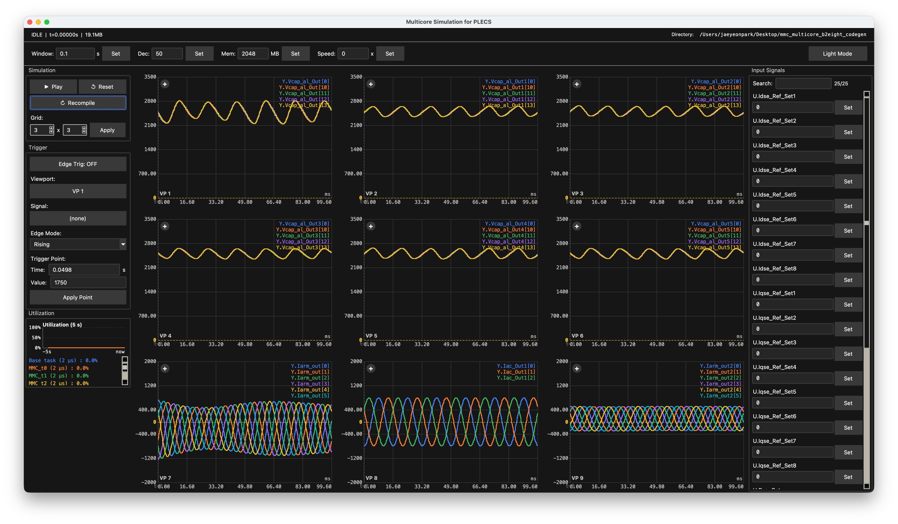

# multicore_sim

PLECS Codegen 시뮬레이션을 위한 멀티코어 시뮬레이터.

[**웹사이트**](https://pcsl-git.github.io/multicore-sim/) · [**다운로드**](https://github.com/PCSL-git/multicore-sim/releases/latest) · [English](README.md)

 

본 프로그램은 PLECS code-generated circuit을 desktop multicore를 이용해 offfline에서 시뮬레이션할 수 있는 프로그램입니다.
기존의 PLECS simulation program에서 싱글 코어 기반으로 동작하던 회로를 멀티 코어로 동작시켜 대규모 전력전자 회로의 모의 시간을 단축시키는 것이 주 목적입니다.

이 저장소는 Release build만 Hosting 하고 있습니다.
프로그램 구입 및 이용 문의는 아래 연락처로 연락주세요.  
최성휘 (Shenghui Cui) — 교수 (Professor) : cuish@snu.ac.kr  
박재연 (Jaeyeon Park) — 개발자 / 박사과정 (Developer / Ph.D Student) : ok6530@snu.ac.kr, jaeyeonparc@icloud.com

기능, 설치 방법, FAQ 는 [프로젝트 웹사이트](https://pcsl-git.github.io/multicore-sim/) 를 참고하세요.

> **참고** — multicore_sim 은 실시간 (real-time) 시뮬레이터가 *아닙니다*. 시뮬레이션 진행 속도는 모델과 호스트 성능에 따라 달라집니다.

> **PLECS / PLECS Coder 라이선스는 포함되어 있지 않습니다.** multicore_sim 은 **PLECS Coder** 가 생성한 C 코드를 실행합니다. **PLECS** 및 **PLECS Coder** 라이선스는 [Plexim](https://www.plexim.com/) 에서 별도로 구매하셔야 합니다. multicore_sim 은 어떠한 PLECS 라이선스도 포함하거나 부여하지 않습니다.

## 다운로드

OS 에 맞는 인스톨러를 [Releases 페이지](https://github.com/PCSL-git/multicore-sim/releases/latest) 에서 받으세요.

| OS | 파일 |
| --- | --- |
| macOS (Apple Silicon / Intel) | `.dmg` |
| Windows 10 / 11 (x64) | `.exe` 인스톨러 |

### 사전 준비 — `gcc`

호스트의 `PATH` 에 C 컴파일러 (`gcc`) 가 있어야 합니다 (시뮬레이터가 PLECS 가 생성한 C 를 실행 시점에 JIT 컴파일합니다).

| OS | 설치 |
| --- | --- |
| macOS | `xcode-select --install` — Apple Clang 이 `gcc` 명령으로 노출됩니다. 또는 GNU GCC 가 필요하면 `brew install gcc`. |
| Windows | [MSYS2](https://www.msys2.org/) 설치 후 **MSYS2 MinGW64** 셸에서 `pacman -S mingw-w64-x86_64-gcc` 실행, 그리고 시스템 `PATH` 에 `C:\msys64\mingw64\bin` 추가. |

`gcc --version` 으로 설치 확인. 자세한 내용은 [웹사이트](https://pcsl-git.github.io/multicore-sim/#install) 참고.

## 라이선스

© Jaeyeon Park / [Power Conversion Systems Laboratory](https://pcsl.snu.ac.kr). 모든 권리 보유. [LICENSE](LICENSE) 참고.

## 만든이

[박재연 (Jaeyeon Park)](https://jaeyeonpark.kr) · [github.com/jaeyeon302](https://github.com/jaeyeon302)

